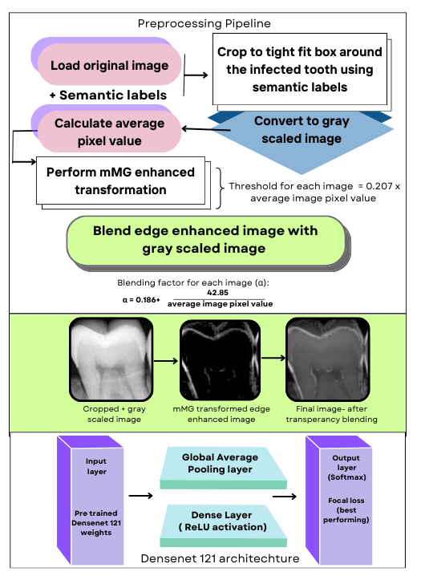

# VisiodentX

**A Deep Learning-based tool for automated detection and treatment recommendation for dental caries using intraoral periapical radiographs (IOPAs).**

 <!-- Optional: Add an image related to your project -->

## Table of Contents
- [Overview](#overview)
- [Features](#features)
- [Dataset](#dataset)
- [Model Architecture](#model-architecture)
- [Results](#results)
- [Future Work](#future-work)
- [License](#license)
- [Acknowledgments](#acknowledgments)

## Overview
Dental caries (tooth decay) is a major public health problem globally, particularly in rural areas with limited access to qualified dental professionals. **VisiodentX** is an automated tool that helps detect and recommend treatments for dental caries using IOPA radiographs. The tool leverages **deep learning models**, including a custom CNN and **DenseNet121**, to classify dental caries into four treatment-based classes:
- No Cavity
- Caries requiring Fillings
- Root Canal Treatment
- Extraction

Our solution aims to improve the accuracy of caries detection and offer a second opinion for dental professionals, especially in underserved rural areas.

## Features
- **Automated detection** of dental caries using intraoral radiographs.
- **Treatment recommendations**: Filling, Root Canal, or Extraction based on severity.
- **Deep learning-powered**: Utilizes DenseNet121 for superior classification performance.
- **Edge enhancement** and **transparency blending** techniques to optimize image quality for the model.
- **Scalable deployment**: Targeted for rural clinics with limited resources.

### Dataset
The dataset consists of **997 intraoral periapical radiographs (IOPAs)** of posterior teeth, classified into four categories:
- No cavity (n=340)
- Caries requiring Fillings (n=242)
- Root canal treatment (n=381)
- Extraction (n=143)

### Image Preprocessing
We use advanced preprocessing techniques to enhance image quality, including:
1. **Edge Enhancement** using a custom implementation of the **Multiple Morphology Gradient (mMG)** algorithm.
2. **Transparency Blending** to merge enhanced and original images dynamically based on pixel intensity.

### Model Architecture
1. **Baseline Model**: A custom CNN with 3 convolutional layers and ReLU activation, followed by Global Average Pooling and fully connected layers.
2. **DenseNet121**: A pre-trained DenseNet121 model fine-tuned for multiclass classification of dental caries, achieving an AUC of 0.86 for binary classification.

### Results
- **Best Performance**: DenseNet121 combined with **Focal Loss** yielded an AUC of 0.86 in binary classification.
- The multi-class classification results provide a promising approach to detecting and recommending treatments for dental caries.

 <!-- Add model performance graphs if available -->

## Future Work
We plan to deploy **VisiodentX** as a smartphone application for real-time caries detection in rural dental setups, potentially extending its capabilities to other dental diseases.

## License

## Acknowledgments
Special thanks to the team at IIT Bombay, Manav Rachna Dental College, and Santosh Dental College for providing valuable insights and resources to make this project possible. We also thank **Dr. Arundeep Singh** for granting access to the dataset.

