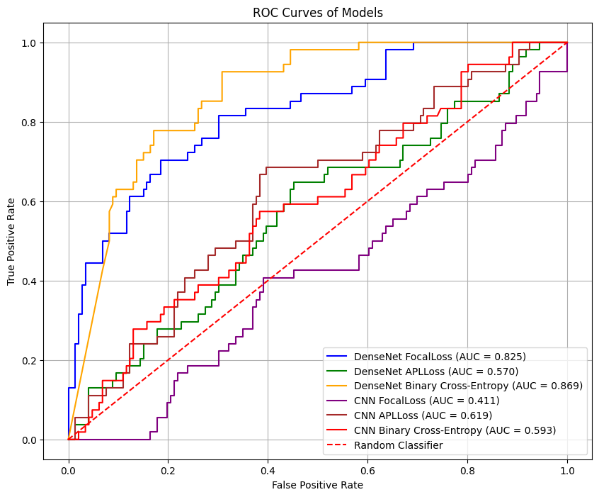

# VisiodentX

**A Deep Learning-based tool for automated detection and treatment recommendation for dental caries using intraoral periapical radiographs (IOPAs).**


## Table of Contents
- [Overview](#overview)
- [Features](#features)
- [Dataset](#dataset)
- [Model Architecture](#model-architecture)
- [Results](#results)
- [Future Work](#future-work)
- [References](#references)
- [License](#license)
- [Acknowledgments](#acknowledgments)

## Overview
Dental caries (tooth decay) is a major public health problem globally, particularly in rural areas with limited access to qualified dental professionals. **VisiodentX** is an automated tool that helps detect and recommend treatments for dental caries using IOPA radiographs. The tool leverages **deep learning models**, including a custom CNN and **DenseNet121**, to classify dental caries into four treatment-based classes:
- No Cavity
- Caries requiring Fillings
- Root Canal Treatment
- Extraction

Our solution aims to improve the accuracy of caries detection and offer a second opinion for dental professionals, especially in underserved rural areas.

## Features
- **Automated detection** of dental caries using intraoral radiographs.
- **Treatment recommendations**: Filling, Root Canal, or Extraction based on severity.
- **Deep learning-powered**: Utilizes DenseNet121 for superior classification performance.
- **Edge enhancement** and **transparency blending** techniques to optimize image quality for the model.
- **Scalable deployment**: Targeted for rural clinics with limited resources.

### Dataset
The dataset consists of **997 intraoral periapical radiographs (IOPAs)** of posterior teeth, classified into four categories:
- No cavity (n=340)
- Caries requiring Fillings (n=242)
- Root canal treatment (n=381)
- Extraction (n=143)

## Image Preprocessing

In **VisiodentX**, image preprocessing is a vital step that ensures the quality and consistency of radiographs before feeding them into the model. Below are the key steps involved:

### 1. Cropping & Grayscale Conversion
- **Objective**: Focus on the tooth area and eliminate unnecessary background.
- **Method**: The image is cropped based on annotated bounding box coordinates. Converting the cropped image to grayscale to reduce computational complexity and focus on intensity-based patterns.
### 2. Edge Enhancement using Multiple Morphology Gradient (mMG) Algorithm
- **Objective**: Enhance the edges to make boundaries of caries more distinct.
- **Method**:  The mMG algorithm combines morphological operations with intensity scaling. The gradient threshold (T) is set dynamically based on the average pixel intensity (P) of the image.
### 3. Alpha Transparency Blending algorithm
- **Objective**: Blend the enhanced edge image with the original grayscale image to maintain clarity and structure.
- **Method**:  Alpha transparency blending is used to combine the two images with a dynamic blending weight (α). The blending weight is inversely proportional to the average pixel intensity (P).
### Here's a breif algorithmic pseudocode which chronologically summarizes the entire preprocessing pipeline

**Input**: Original radiographs and their semantic labels  
**Parameters**: Smoothing factor, gradient threshold, blending weight (alpha), average pixel brightness  
**Output**: Preprocessed Radiograph  

```python
# Step 1: Cropping and Grayscale Conversion
for every image in original_radiographs do
    # Get bounding box coordinates using semantic labels
    bounding_box = get_bounding_box(semantic_labels)

    # Crop the original image around these coordinates
    cropped_image = crop_image(original_image, bounding_box)

    # Convert the image to grayscale
    grayscale_image = convert_to_grayscale(cropped_image)

    # Return Cropped + Grayscaled image
    cropped_grayscaled_images.append(grayscale_image)
end for

# Load data: Cropped + Grayscaled images
cropped_grayscaled_images = load_data()

# Step 2: Edge Enhancement using mMG
for every cropped_grayscaled_image in cropped_grayscaled_images do
    # Compute average pixel brightness
    average_pixel_brightness = compute_average_brightness(cropped_grayscaled_image)

    # Determine the gradient threshold using average pixel brightness
    gradient_threshold = compute_gradient_threshold(average_pixel_brightness)

    # Apply enhancement mMG with the computed threshold
    enhanced_image = apply_enhancement_mMG(cropped_grayscaled_image, gradient_threshold)

    # Return Enhanced image
    enhanced_images.append(enhanced_image)
end for

# Load data: Enhanced images, Cropped + Grayscaled images
enhanced_images = load_data()

# Step 3: Transparency Blending
for every cropped_grayscaled_image in cropped_grayscaled_images do
    # Compute average pixel brightness
    average_pixel_brightness = compute_average_brightness(cropped_grayscaled_image)

    # Compute blending weight (alpha) using the average pixel brightness
    blending_weight = compute_blending_weight(average_pixel_brightness)

    # Blend the enhanced image with the cropped + grayscaled image
    final_preprocessed_image = blend_images(enhanced_image, cropped_grayscaled_image, blending_weight)

    # Return Final preprocessed image
    final_preprocessed_images.append(final_preprocessed_image)
end for

# End of algorithm
```


### Model Architecture
1. **Baseline Model**: A custom CNN with 3 convolutional layers and ReLU activation, followed by Global Average Pooling and fully connected layers.
2. **DenseNet121**: A pre-trained DenseNet121 model fine-tuned for multiclass classification of dental caries, achieving an AUC of 0.86 for binary classification.


### Results
- **Best Performance**: DenseNet121 combined with **Focal Loss** yielded an AUC of 0.86 in binary classification.
- The multi-class classification results provide a promising approach to detecting and recommending treatments for dental caries.

 <!-- Add model performance graphs if available -->

## Future Work
We plan to deploy **VisiodentX** as a smartphone application for real-time caries detection in rural dental setups, potentially extending its capabilities to other dental diseases.

## References
1. F Schwendicke, CE Dörfer, P Schlattmann, L Foster Page, WM Thomson, and S Paris, “[Socioeconomic inequality and caries: a systematic review and meta-analysis](https://doi.org/10.1177/0022034514557546),” *Journal of dental research*, vol. 94, no. 1, pp. 10–18, 2015.

2. Shivanjali Grover, Meetika Pahuja, Sanchit Pradhan, Mohd Akif, and Kanchan Shukla, “[Rural oral health: Challenges and pit falls: Time to recover and rebuild the pathway](https://doi.org/10.37506/ijphrd.v11i6.10230),” *Indian Journal of Public Health Research & Development*, vol. 11, no. 6, pp. 893–897, 2020.

3. James R Keenan and Analia Veitz Keenan, “[Accuracy of dental radiographs for caries detection](https://doi.org/10.1038/sj.ebd.6401144),” *Evidence-based dentistry*, vol. 17, no. 2, pp. 43–43, 2016.

4. Hu Chen, Kailai Zhang, Peijun Lyu, Hong Li, Ludan Zhang, Ji Wu, and Chin-Hui Lee, “[A deep learning approach to automatic teeth detection and numbering based on object detection in dental periapical films](https://doi.org/10.1038/s41598-019-40230-5),” *Scientific reports*, vol. 9, no. 1, pp. 3840, 2019.

5. Jufriadif Naam, Johan Harlan, Sarifuddin Madenda, and Eri Prasetio Wibowo, “[Identification of the proximal caries of dental x-ray image with multiple morphology gradient method](https://doi.org/10.18517/ijaseit.6.3.1002),” *International Journal on Advanced Science, Engineering and Information Technology*, vol. 6, no. 3, pp. 343–346, 2016.

6. Jufriadif Naam, Johan Harlan, Sarifuddin Madenda, and Eri Prasetio Wibowo, “[The algorithm of image edge detection on panoramic dental x-ray using multiple morphological gradient (mmg) method](https://doi.org/10.18517/ijaseit.6.6.1053),” *International Journal on Advanced Science, Engineering and Information Technology*, vol. 6, no. 6, pp. 1012–1018, 2016.

7. Jae-Hong Lee, Do-Hyung Kim, Seong-Nyum Jeong, and Seong-Ho Choi, “[Detection and diagnosis of dental caries using a deep learning-based convolutional neural network algorithm](https://doi.org/10.1016/j.jdent.2018.07.015),” *Journal of dentistry*, vol. 77, pp. 106–111, 2018.

8. Ming Hong Jim Pun, “[Real-time caries detection of bitewing radiographs using a mobile phone and an artificial neural network: A pilot study](https://doi.org/10.3390/oral3030037),” *Oral*, vol. 3, no. 3, pp. 437–449, 2023.

9. Xiujiao Lin, Dengwei Hong, Dong Zhang, Mingyi Huang, and Hao Yu, “[Detecting proximal caries on periapical radiographs using convolutional neural networks with different training strategies on small datasets](https://doi.org/10.3390/diagnostics12051047),” *Diagnostics*, vol. 12, no. 5, pp. 1047, 2022.

10. KK MATHUVANTI, D Prabu, R Sindhu, DINESH DHAMODHAR, M Rajmohan, VV BHARATHWAJ, S Sathiyapriya, and M Vishali, “[Analysis of dental caries from intra-oral periapical radiographs using machine learning models](https://doi.org/10.1055/s-0041-1745550),” *International Journal of Dental and Clinical Study*, vol. 3, no. 3, pp. 01–09, 2022.

11. Viktor Szabó, Bence Tamas Szabo, Kaan Orhan, Dániel Sándor Veres, David Manulis, Matvey Ezhov, and Alex Sanders, “[Validation of artificial intelligence application for dental caries diagnosis on intraoral bitewing and periapical radiographs](https://doi.org/10.1016/j.jdent.2024.105105),” *Journal of Dentistry*, p. 105105, 2024.

12. Anselmo Garcia Cantu, Sascha Gehrung, Joachim Krois, Akhilanand Chaurasia, Jesus Gomez Rossi, Robert Gaudin, Karim Elhennawy, and Falk Schwendicke, “[Detecting caries lesions of different radiographic extension on bitewings using deep learning](https://doi.org/10.1016/j.jdent.2020.103425),” *Journal of Dentistry*, vol. 100, pp. 103425, 2020.


## License


## Acknowledgments
Special thanks to the team at IIT Bombay, Manav Rachna Dental College, and Santosh Dental College for providing valuable insights and resources to make this project possible. We also thank **Dr. Arundeep Singh** for granting access to the dataset.

